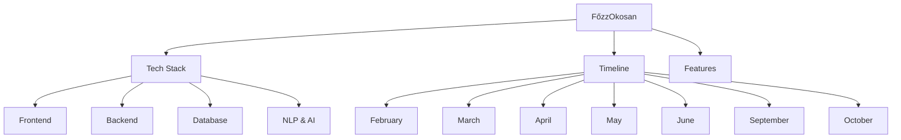

# FőzzOkosan - Project Map

> Tags: `project` `thesis` `moc`

---

## Quick Links

---

## Core Documents

| Document | Description |
|----------|-------------|
| [Project Overview](Project%20Overview.md) | Project summary and goals |
| [Tech Stack](Tech%20Stack.md) | All technologies used |
| [Features](Features.md) | Complete feature list |
| [Timeline](Timeline.md) | Monthly breakdown |
| [Risks](Risks.md) | Risk management |

---

## Tech Stack

- [Frontend](Frontend.md) - React + TypeScript + TailwindCSS
- [Backend](Backend.md) - NestJS + Prisma
- [Database](Database.md) - PostgreSQL schema
- [NLP & AI](NLP%20%26%20AI.md) - Google Gemini integration

---

## Monthly Timeline

| Month | Focus | Status |
|-------|-------|--------|
| [February](February.md) | Setup & Auth | ⬜ Not Started |
| [March](March.md) | CRUD & UI | ⬜ Not Started |
| [April](April.md) | Units & Data | ⬜ Not Started |
| [May](May.md) | Shopping List | ⬜ Not Started |
| [June](June.md) | NLP & Docs | ⬜ Not Started |
| [September](September.md) | Testing & Menu | ⬜ Not Started |
| [October](October.md) | Final Docs | ⬜ Not Started |

---

## Repository

- **GitHub**: https://github.com/zkaskoo/F-zzOkosan
- **Local Path**: `/Users/zoltantoth/Documents/Egyetem/Szakdolgozat`

---

## Tags

`react` `nestjs` `typescript` `postgresql` `gemini` `nlp`
