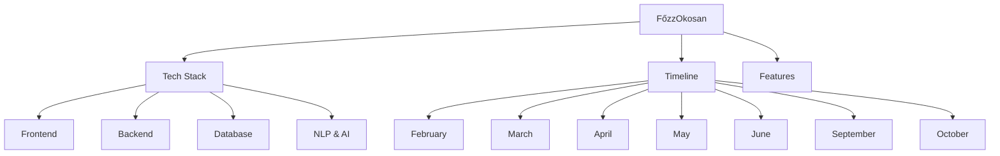

# FőzzOkosan - Project Map

#project #thesis #moc

---

## Quick Links

---

## Core Documents

| Document | Description |
|----------|-------------|
| [[Project Overview]] | Project summary and goals |
| [[Tech Stack]] | All technologies used |
| [[Features]] | Complete feature list |
| [[Timeline]] | Monthly breakdown |
| [[Risks]] | Risk management |

---

## Tech Stack

- [[Frontend]] - React + TypeScript + TailwindCSS
- [[Backend]] - NestJS + Prisma
- [[Database]] - PostgreSQL schema
- [[NLP & AI]] - Google Gemini integration

---

## Monthly Timeline

| Month | Focus | Status |
|-------|-------|--------|
| [[February]] | Setup & Auth | 🔲 Not Started |
| [[March]] | CRUD & UI | 🔲 Not Started |
| [[April]] | Units & Data | 🔲 Not Started |
| [[May]] | Shopping List | 🔲 Not Started |
| [[June]] | NLP & Docs | 🔲 Not Started |
| [[September]] | Testing & Menu | 🔲 Not Started |
| [[October]] | Final Docs | 🔲 Not Started |

---

## Repository

- **GitHub**: https://github.com/zkaskoo/F-zzOkosan
- **Local Path**: `/Users/zoltantoth/Documents/Egyetem/Szakdolgozat`

---

## Tags

#react #nestjs #typescript #postgresql #gemini #nlp
