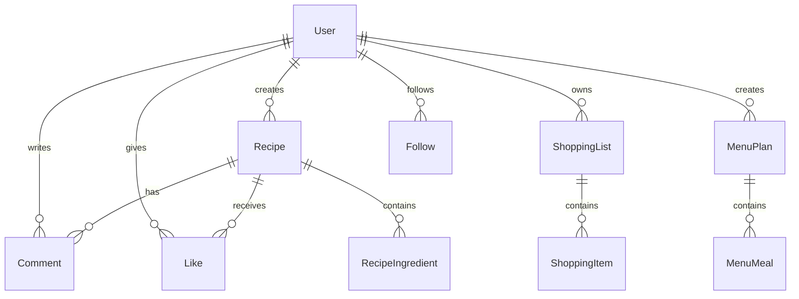

# Database

> Tags: `database #postgresql #prisma

---

## Technology

| Tech | Purpose |
|------|---------|
| PostgreSQL | Database engine |
| Prisma | ORM |
| Supabase / Neon | Hosting (free) |

---

## Schema Diagram



---

## Prisma Schema

```prisma
// prisma/schema.prisma

generator client {
  provider = "prisma-client-js"
}

datasource db {
  provider = "postgresql"
  url      = env("DATABASE_URL")
}

model User {
  id            String    @id @default(uuid())
  email         String    @unique
  username      String    @unique
  password      String
  avatar        String?
  bio           String?
  createdAt     DateTime  @default(now())
  updatedAt     DateTime  @updatedAt

  recipes       Recipe[]
  comments      Comment[]
  likes         Like[]
  shoppingLists ShoppingList[]
  menuPlans     MenuPlan[]
  followers     Follow[]  @relation("following")
  following     Follow[]  @relation("follower")
}

model Recipe {
  id                String   @id @default(uuid())
  title             String
  description       String?
  ingredientsRaw    String   // Original free text
  parsedIngredients Json     // Parsed by NLP
  instructions      String
  image             String?
  cookingTime       Int?     // In minutes
  servings          Int      @default(4)
  category          String?
  allergens         String[] // Array of allergens
  dietTags          String[] // vegetarian, vegan, etc.
  createdAt         DateTime @default(now())
  updatedAt         DateTime @updatedAt

  userId            String
  user              User     @relation(fields: [userId], references: [id])
  comments          Comment[]
  likes             Like[]

  @@index([userId])
}

model Comment {
  id        String   @id @default(uuid())
  content   String
  createdAt DateTime @default(now())

  userId    String
  user      User     @relation(fields: [userId], references: [id])
  recipeId  String
  recipe    Recipe   @relation(fields: [recipeId], references: [id], onDelete: Cascade)

  @@index([recipeId])
}

model Like {
  id        String   @id @default(uuid())
  createdAt DateTime @default(now())

  userId    String
  user      User     @relation(fields: [userId], references: [id])
  recipeId  String
  recipe    Recipe   @relation(fields: [recipeId], references: [id], onDelete: Cascade)

  @@unique([userId, recipeId])
}

model Follow {
  id          String   @id @default(uuid())
  createdAt   DateTime @default(now())

  followerId  String
  follower    User     @relation("follower", fields: [followerId], references: [id])
  followingId String
  following   User     @relation("following", fields: [followingId], references: [id])

  @@unique([followerId, followingId])
}

model ShoppingList {
  id        String   @id @default(uuid())
  name      String
  items     Json     // Array of shopping items
  completed Boolean  @default(false)
  createdAt DateTime @default(now())
  updatedAt DateTime @updatedAt

  userId    String
  user      User     @relation(fields: [userId], references: [id])

  @@index([userId])
}

model MenuPlan {
  id            String   @id @default(uuid())
  weekStartDate DateTime
  meals         Json     // { monday: { lunch: recipeId, dinner: recipeId }, ... }
  createdAt     DateTime @default(now())
  updatedAt     DateTime @updatedAt

  userId        String
  user          User     @relation(fields: [userId], references: [id])

  @@index([userId])
}
```

---

## Parsed Ingredients JSON Structure

```json
{
  "parsedIngredients": [
    {
      "name": "liszt",
      "originalText": "50 dkg liszt",
      "quantity": 500,
      "unit": "g",
      "originalUnit": "dkg",
      "category": "dry-goods"
    },
    {
      "name": "tojás",
      "originalText": "3 tojás",
      "quantity": 3,
      "unit": "db",
      "category": "dairy"
    },
    {
      "name": "olívaolaj",
      "originalText": "2 evőkanál olívaolaj",
      "quantity": 30,
      "unit": "ml",
      "originalUnit": "ek",
      "category": "oils"
    }
  ]
}
```

---

## Shopping List Items JSON

```json
{
  "items": [
    {
      "name": "liszt",
      "quantity": 750,
      "unit": "g",
      "checked": false,
      "fromRecipes": ["recipe-uuid-1", "recipe-uuid-2"]
    },
    {
      "name": "tojás",
      "quantity": 5,
      "unit": "db",
      "checked": true,
      "fromRecipes": ["recipe-uuid-1"]
    }
  ]
}
```

---

## Setup Commands

```bash
# Initialize Prisma
npx prisma init

# Generate client after schema changes
npx prisma generate

# Create migration
npx prisma migrate dev --name init

# Open Prisma Studio (GUI)
npx prisma studio

# Push schema (development)
npx prisma db push
```

---

## Related

- [Tech Stack](Tech%20Stack.md)
- [Backend](Backend.md)
- [Index](00%20-%20Index.md)
