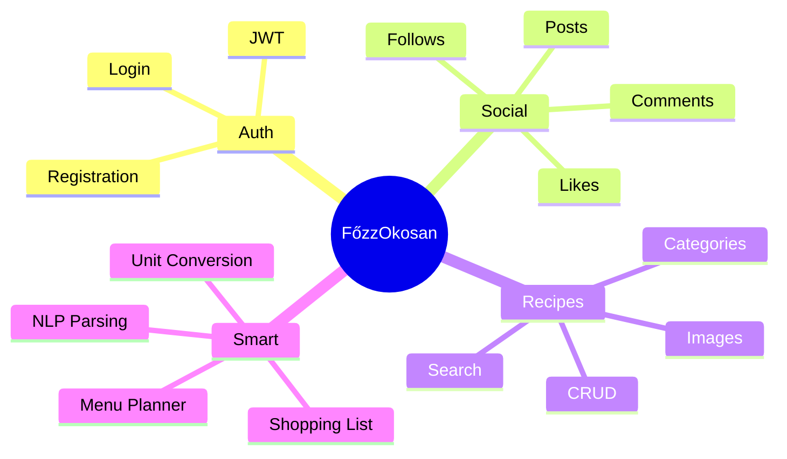

# Features

> Tags: `features` `requirements`

---

## Feature Overview

---

## Authentication & Users

| Feature | Description | Priority | Status |
|---------|-------------|----------|--------|
| Registration | Email + password signup | High | ⬜ Todo |
| Login | JWT-based auth | High | ⬜ Todo |
| Profile | View/edit user info | Medium | ⬜ Todo |
| Avatar | Profile picture upload | Low | ⬜ Todo |
| Password reset | Email-based reset | Low | ⬜ Todo |

---

## Recipe Management

| Feature | Description | Priority | Status |
|---------|-------------|----------|--------|
| Create recipe | Title, ingredients, instructions | High | ⬜ Todo |
| Edit recipe | Update own recipes | High | ⬜ Todo |
| Delete recipe | Remove own recipes | High | ⬜ Todo |
| View recipe | Recipe detail page | High | ⬜ Todo |
| Recipe images | Photo upload | High | ⬜ Todo |
| Categories | Organize by type | Medium | ⬜ Todo |
| Cooking time | Duration field | Low | ⬜ Todo |
| Servings | Portion count | Low | ⬜ Todo |

---

## Social Features

| Feature | Description | Priority | Status |
|---------|-------------|----------|--------|
| Recipe feed | Home page with recipes | High | ⬜ Todo |
| Like recipe | Heart button | High | ⬜ Todo |
| Unlike recipe | Remove like | High | ⬜ Todo |
| Comment | Add comments | Medium | ⬜ Todo |
| Delete comment | Remove own comments | Medium | ⬜ Todo |
| Follow user | Follow other users | Medium | ⬜ Todo |
| Unfollow user | Remove follow | Medium | ⬜ Todo |
| User discovery | Find users | Low | ⬜ Todo |

---

## Search & Discovery

| Feature | Description | Priority | Status |
|---------|-------------|----------|--------|
| Search by title | Text search | High | ⬜ Todo |
| Search by ingredient | Find by ingredient | Medium | ⬜ Todo |
| Filter by category | Category filter | Medium | ⬜ Todo |
| Filter by diet | Vegetarian, vegan, etc. | Medium | ⬜ Todo |
| Filter by allergen | Exclude allergens | Medium | ⬜ Todo |

---

## Smart Features (Core Innovation)

| Feature | Description | Priority | Status |
|---------|-------------|----------|--------|
| NLP parsing | Parse free-text ingredients | **Critical** | ⬜ Todo |
| Unit conversion | dkg→g, ek→ml, etc. | **Critical** | ⬜ Todo |
| Shopping list | Generate from recipe | **Critical** | ⬜ Todo |
| Multi-recipe merge | Combine ingredients | **Critical** | ⬜ Todo |
| Menu planner | Weekly meal planning | High | ⬜ Todo |
| Week shopping list | List for whole week | High | ⬜ Todo |

---

## User Interface

| Feature | Description | Priority | Status |
|---------|-------------|----------|--------|
| Responsive design | Mobile-friendly | High | ⬜ Todo |
| Dark mode | Theme toggle | Low | ⬜ Todo |
| Loading states | Skeleton loaders | Medium | ⬜ Todo |
| Error handling | User-friendly errors | Medium | ⬜ Todo |
| Toast notifications | Action feedback | Low | ⬜ Todo |

---

## Priority Legend

| Priority | Meaning |
|----------|---------|
| **Critical** | Must have for thesis |
| High | Important feature |
| Medium | Nice to have |
| Low | If time permits |

---

## MVP Features (Minimum Viable Product)

Must be complete for thesis:

- [ ] User registration & login
- [ ] Recipe CRUD with images
- [ ] Like & comment
- [ ] NLP ingredient parsing
- [ ] Unit conversion
- [ ] Shopping list generation
- [ ] Multi-recipe merge
- [ ] Weekly menu planner

---

## Related

- [Project Overview](Project%20Overview.md)
- [Timeline](Timeline.md)
- [Index](00%20-%20Index.md)
