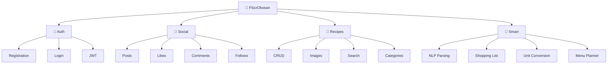

# Features

> Tags: `features` `requirements`

---

## Feature Overview

---

## Authentication & Users

| Feature | Description | Priority | Status |
|---------|-------------|----------|--------|
| **Registration** | Email + password signup |  |  |
| **Login** | JWT-based auth |  |  |
| **Profile** | View/edit user info |  |  |
| **Avatar** | Profile picture upload |  |  |
| **Password reset** | Email-based reset |  |  |

---

## Recipe Management

| Feature | Description | Priority | Status |
|---------|-------------|----------|--------|
| **Create recipe** | Title, ingredients, instructions |  |  |
| **Edit recipe** | Update own recipes |  |  |
| **Delete recipe** | Remove own recipes |  |  |
| **View recipe** | Recipe detail page |  |  |
| **Recipe images** | Photo upload |  |  |
| **Categories** | Organize by type |  |  |
| **Cooking time** | Duration field |  |  |
| **Servings** | Portion count |  |  |

---

## Social Features

| Feature | Description | Priority | Status |
|---------|-------------|----------|--------|
| **Recipe feed** | Home page with recipes |  |  |
| **Like recipe** | Heart button |  |  |
| **Unlike recipe** | Remove like |  |  |
| **Comment** | Add comments |  |  |
| **Delete comment** | Remove own comments |  |  |
| **Follow user** | Follow other users |  |  |
| **Unfollow user** | Remove follow |  |  |
| **User discovery** | Find users |  |  |

---

## Search & Discovery

| Feature | Description | Priority | Status |
|---------|-------------|----------|--------|
| **Search by title** | Text search |  |  |
| **Search by ingredient** | Find by ingredient |  |  |
| **Filter by category** | Category filter |  |  |
| **Filter by diet** | Vegetarian, vegan, etc. |  |  |
| **Filter by allergen** | Exclude allergens |  |  |

---

## Smart Features (Core Innovation)

| Feature | Description | Priority | Status |
|---------|-------------|----------|--------|
| **NLP parsing** | Parse free-text ingredients |  |  |
| **Unit conversion** | dkg→g, ek→ml, etc. |  |  |
| **Shopping list** | Generate from recipe |  |  |
| **Multi-recipe merge** | Combine ingredients |  |  |
| **Menu planner** | Weekly meal planning |  |  |
| **Week shopping list** | List for whole week |  |  |

---

## User Interface

| Feature | Description | Priority | Status |
|---------|-------------|----------|--------|
| **Responsive design** | Mobile-friendly |  |  |
| **Dark mode** | Theme toggle |  |  |
| **Loading states** | Skeleton loaders |  |  |
| **Error handling** | User-friendly errors |  |  |
| **Toast notifications** | Action feedback |  |  |

---

## Priority Legend

| Badge | Meaning |
|-------|---------|
|  | Must have for thesis |
|  | Important feature |
|  | Nice to have |
|  | If time permits |

## Status Legend

| Badge | Meaning |
|-------|---------|
|  | Not started |
|  | Currently working |
|  | Completed |

---

## MVP Features (Minimum Viable Product)

Must be complete for thesis:

- [x] User registration & login
- [x] Recipe CRUD with images
- [x] Like & comment
- [ ] NLP ingredient parsing
- [ ] Unit conversion
- [ ] Shopping list generation
- [ ] Multi-recipe merge
- [ ] Weekly menu planner

---

## Related

- [Project Overview](Project%20Overview.md)
- [Timeline](Timeline.md)
- [Index](00%20-%20Index.md)
