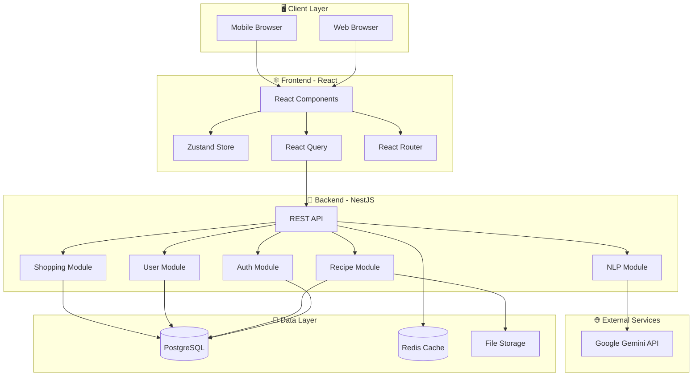
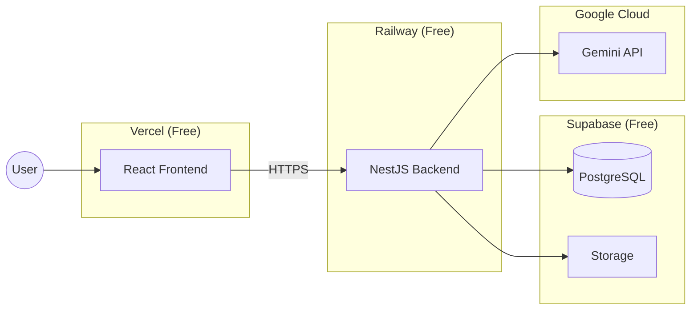
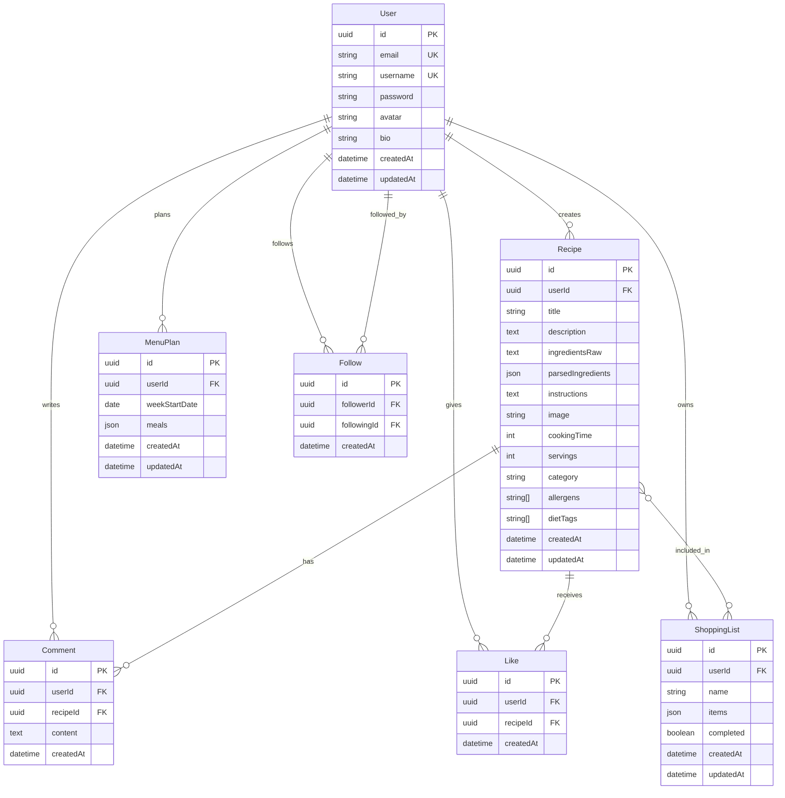
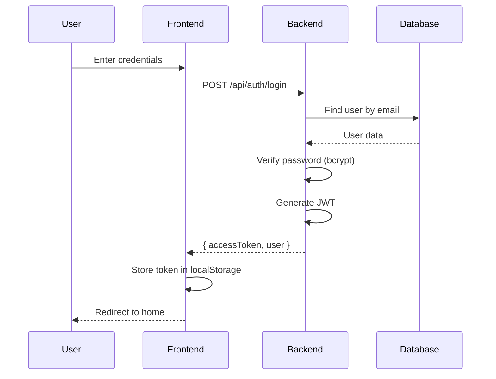
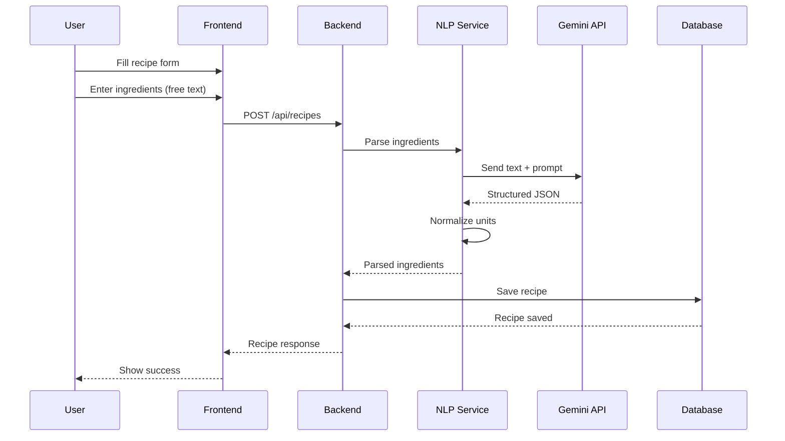
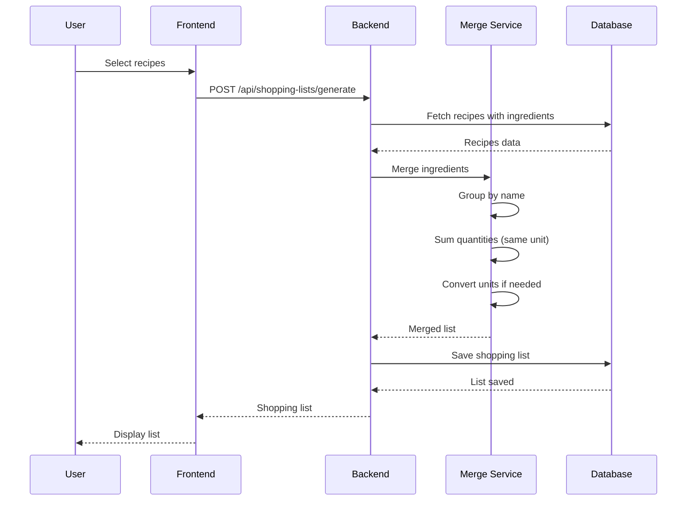

# System Design

> Tags: `architecture` `design` `february`

---

## 1. System Architecture

### 1.1 High-Level Architecture



### 1.2 Deployment Architecture



---

## 2. Database Schema

### 2.1 Entity Relationship Diagram



### 2.2 Prisma Schema

```prisma
// prisma/schema.prisma

generator client {
  provider = "prisma-client-js"
}

datasource db {
  provider = "postgresql"
  url      = env("DATABASE_URL")
}

model User {
  id            String    @id @default(uuid())
  email         String    @unique
  username      String    @unique
  password      String
  avatar        String?
  bio           String?
  createdAt     DateTime  @default(now())
  updatedAt     DateTime  @updatedAt

  // Relations
  recipes       Recipe[]
  comments      Comment[]
  likes         Like[]
  shoppingLists ShoppingList[]
  menuPlans     MenuPlan[]
  followers     Follow[]  @relation("following")
  following     Follow[]  @relation("follower")

  @@index([email])
  @@index([username])
}

model Recipe {
  id                String   @id @default(uuid())
  title             String
  description       String?
  ingredientsRaw    String   @db.Text
  parsedIngredients Json     @default("[]")
  instructions      String   @db.Text
  image             String?
  cookingTime       Int?
  servings          Int      @default(4)
  category          String?
  allergens         String[] @default([])
  dietTags          String[] @default([])
  createdAt         DateTime @default(now())
  updatedAt         DateTime @updatedAt

  // Relations
  userId            String
  user              User     @relation(fields: [userId], references: [id], onDelete: Cascade)
  comments          Comment[]
  likes             Like[]

  @@index([userId])
  @@index([category])
  @@index([createdAt])
}

model Comment {
  id        String   @id @default(uuid())
  content   String   @db.Text
  createdAt DateTime @default(now())

  userId    String
  user      User     @relation(fields: [userId], references: [id], onDelete: Cascade)
  recipeId  String
  recipe    Recipe   @relation(fields: [recipeId], references: [id], onDelete: Cascade)

  @@index([recipeId])
  @@index([userId])
}

model Like {
  id        String   @id @default(uuid())
  createdAt DateTime @default(now())

  userId    String
  user      User     @relation(fields: [userId], references: [id], onDelete: Cascade)
  recipeId  String
  recipe    Recipe   @relation(fields: [recipeId], references: [id], onDelete: Cascade)

  @@unique([userId, recipeId])
  @@index([recipeId])
}

model Follow {
  id          String   @id @default(uuid())
  createdAt   DateTime @default(now())

  followerId  String
  follower    User     @relation("follower", fields: [followerId], references: [id], onDelete: Cascade)
  followingId String
  following   User     @relation("following", fields: [followingId], references: [id], onDelete: Cascade)

  @@unique([followerId, followingId])
  @@index([followerId])
  @@index([followingId])
}

model ShoppingList {
  id        String   @id @default(uuid())
  name      String
  items     Json     @default("[]")
  completed Boolean  @default(false)
  createdAt DateTime @default(now())
  updatedAt DateTime @updatedAt

  userId    String
  user      User     @relation(fields: [userId], references: [id], onDelete: Cascade)

  @@index([userId])
}

model MenuPlan {
  id            String   @id @default(uuid())
  weekStartDate DateTime @db.Date
  meals         Json     @default("{}")
  createdAt     DateTime @default(now())
  updatedAt     DateTime @updatedAt

  userId        String
  user          User     @relation(fields: [userId], references: [id], onDelete: Cascade)

  @@unique([userId, weekStartDate])
  @@index([userId])
}
```

---

## 3. API Endpoints

### 3.1 Authentication

| Method | Endpoint | Description | Auth |
|--------|----------|-------------|------|
| `POST` | `/api/auth/register` | Register new user | No |
| `POST` | `/api/auth/login` | Login, returns JWT | No |
| `POST` | `/api/auth/refresh` | Refresh access token | Yes |
| `GET` | `/api/auth/me` | Get current user | Yes |
| `POST` | `/api/auth/logout` | Logout (invalidate token) | Yes |

**Register Request:**
```json
POST /api/auth/register
{
  "email": "user@example.com",
  "username": "johndoe",
  "password": "securePassword123"
}
```

**Login Response:**
```json
{
  "accessToken": "eyJhbGciOiJIUzI1NiIs...",
  "user": {
    "id": "uuid",
    "email": "user@example.com",
    "username": "johndoe",
    "avatar": null
  }
}
```

### 3.2 Users

| Method | Endpoint | Description | Auth |
|--------|----------|-------------|------|
| `GET` | `/api/users/:id` | Get user profile | No |
| `GET` | `/api/users/:id/recipes` | Get user's recipes | No |
| `PATCH` | `/api/users/:id` | Update profile | Yes |
| `POST` | `/api/users/:id/follow` | Follow user | Yes |
| `DELETE` | `/api/users/:id/follow` | Unfollow user | Yes |
| `GET` | `/api/users/:id/followers` | Get followers | No |
| `GET` | `/api/users/:id/following` | Get following | No |

### 3.3 Recipes

| Method | Endpoint | Description | Auth |
|--------|----------|-------------|------|
| `GET` | `/api/recipes` | Get feed (paginated) | No |
| `GET` | `/api/recipes/:id` | Get single recipe | No |
| `POST` | `/api/recipes` | Create recipe | Yes |
| `PATCH` | `/api/recipes/:id` | Update recipe | Yes |
| `DELETE` | `/api/recipes/:id` | Delete recipe | Yes |
| `GET` | `/api/recipes/search` | Search recipes | No |
| `POST` | `/api/recipes/:id/like` | Like recipe | Yes |
| `DELETE` | `/api/recipes/:id/like` | Unlike recipe | Yes |

**Create Recipe Request:**
```json
POST /api/recipes
{
  "title": "Palacsinta",
  "description": "Klasszikus magyar palacsinta",
  "ingredientsRaw": "30 dkg liszt, 5 dl tej, 2 tojás, csipet só, 2 ek olaj",
  "instructions": "1. Keverjük össze...\n2. Süssük ki...",
  "cookingTime": 30,
  "servings": 4,
  "category": "dessert",
  "allergens": ["gluten", "lactose", "eggs"],
  "dietTags": ["vegetarian"]
}
```

**Recipe Response (with parsed ingredients):**
```json
{
  "id": "uuid",
  "title": "Palacsinta",
  "ingredientsRaw": "30 dkg liszt, 5 dl tej...",
  "parsedIngredients": [
    { "name": "liszt", "quantity": 300, "unit": "g", "original": "30 dkg liszt" },
    { "name": "tej", "quantity": 500, "unit": "ml", "original": "5 dl tej" },
    { "name": "tojás", "quantity": 2, "unit": "db", "original": "2 tojás" },
    { "name": "só", "quantity": null, "unit": "csipet", "original": "csipet só" },
    { "name": "olaj", "quantity": 30, "unit": "ml", "original": "2 ek olaj" }
  ],
  "user": { "id": "uuid", "username": "johndoe", "avatar": "..." },
  "likesCount": 42,
  "commentsCount": 5,
  "isLiked": true
}
```

### 3.4 Comments

| Method | Endpoint | Description | Auth |
|--------|----------|-------------|------|
| `GET` | `/api/recipes/:id/comments` | Get comments | No |
| `POST` | `/api/recipes/:id/comments` | Add comment | Yes |
| `DELETE` | `/api/comments/:id` | Delete comment | Yes |

### 3.5 Shopping Lists

| Method | Endpoint | Description | Auth |
|--------|----------|-------------|------|
| `GET` | `/api/shopping-lists` | Get user's lists | Yes |
| `GET` | `/api/shopping-lists/:id` | Get single list | Yes |
| `POST` | `/api/shopping-lists` | Create empty list | Yes |
| `POST` | `/api/shopping-lists/generate` | Generate from recipes | Yes |
| `PATCH` | `/api/shopping-lists/:id` | Update list | Yes |
| `DELETE` | `/api/shopping-lists/:id` | Delete list | Yes |

**Generate Shopping List Request:**
```json
POST /api/shopping-lists/generate
{
  "name": "Hétvégi bevásárlás",
  "recipeIds": ["uuid1", "uuid2", "uuid3"]
}
```

**Generate Response (merged ingredients):**
```json
{
  "id": "uuid",
  "name": "Hétvégi bevásárlás",
  "items": [
    { "name": "liszt", "quantity": 800, "unit": "g", "checked": false, "fromRecipes": ["uuid1", "uuid2"] },
    { "name": "tej", "quantity": 1000, "unit": "ml", "checked": false, "fromRecipes": ["uuid1", "uuid3"] },
    { "name": "tojás", "quantity": 6, "unit": "db", "checked": false, "fromRecipes": ["uuid1", "uuid2", "uuid3"] }
  ],
  "completed": false
}
```

### 3.6 Menu Plans

| Method | Endpoint | Description | Auth |
|--------|----------|-------------|------|
| `GET` | `/api/menu-plans` | Get user's plans | Yes |
| `GET` | `/api/menu-plans/:weekStart` | Get specific week | Yes |
| `PUT` | `/api/menu-plans/:weekStart` | Create/update week | Yes |
| `DELETE` | `/api/menu-plans/:weekStart` | Delete week plan | Yes |
| `POST` | `/api/menu-plans/:weekStart/shopping-list` | Generate list for week | Yes |

**Menu Plan Structure:**
```json
{
  "weekStartDate": "2025-02-03",
  "meals": {
    "monday": { "lunch": "recipe-uuid-1", "dinner": "recipe-uuid-2" },
    "tuesday": { "lunch": null, "dinner": "recipe-uuid-3" },
    "wednesday": { "lunch": "recipe-uuid-4", "dinner": null }
  }
}
```

### 3.7 NLP

| Method | Endpoint | Description | Auth |
|--------|----------|-------------|------|
| `POST` | `/api/nlp/parse` | Parse ingredients text | Yes |

**Parse Request:**
```json
POST /api/nlp/parse
{
  "text": "2 ek olívaolaj, fél kg csirkemell, 3 gerezd fokhagyma, só bors ízlés szerint"
}
```

**Parse Response:**
```json
{
  "ingredients": [
    { "name": "olívaolaj", "quantity": 30, "unit": "ml", "original": "2 ek olívaolaj" },
    { "name": "csirkemell", "quantity": 500, "unit": "g", "original": "fél kg csirkemell" },
    { "name": "fokhagyma", "quantity": 3, "unit": "gerezd", "original": "3 gerezd fokhagyma" },
    { "name": "só", "quantity": null, "unit": "ízlés szerint", "original": "só bors ízlés szerint" },
    { "name": "bors", "quantity": null, "unit": "ízlés szerint", "original": "só bors ízlés szerint" }
  ]
}
```

---

## 4. Module Structure

### 4.1 Backend Modules (NestJS)

```
backend/
├── src/
│   ├── main.ts                    # Entry point
│   ├── app.module.ts              # Root module
│   │
│   ├── config/
│   │   ├── config.module.ts
│   │   └── configuration.ts       # Environment config
│   │
│   ├── prisma/
│   │   ├── prisma.module.ts
│   │   └── prisma.service.ts      # Database connection
│   │
│   ├── auth/
│   │   ├── auth.module.ts
│   │   ├── auth.controller.ts     # /api/auth/*
│   │   ├── auth.service.ts
│   │   ├── jwt.strategy.ts        # JWT validation
│   │   ├── jwt-auth.guard.ts
│   │   └── dto/
│   │       ├── register.dto.ts
│   │       └── login.dto.ts
│   │
│   ├── users/
│   │   ├── users.module.ts
│   │   ├── users.controller.ts    # /api/users/*
│   │   ├── users.service.ts
│   │   └── dto/
│   │       └── update-user.dto.ts
│   │
│   ├── recipes/
│   │   ├── recipes.module.ts
│   │   ├── recipes.controller.ts  # /api/recipes/*
│   │   ├── recipes.service.ts
│   │   └── dto/
│   │       ├── create-recipe.dto.ts
│   │       └── update-recipe.dto.ts
│   │
│   ├── comments/
│   │   ├── comments.module.ts
│   │   ├── comments.controller.ts
│   │   ├── comments.service.ts
│   │   └── dto/
│   │       └── create-comment.dto.ts
│   │
│   ├── likes/
│   │   ├── likes.module.ts
│   │   ├── likes.controller.ts
│   │   └── likes.service.ts
│   │
│   ├── follows/
│   │   ├── follows.module.ts
│   │   ├── follows.controller.ts
│   │   └── follows.service.ts
│   │
│   ├── shopping/
│   │   ├── shopping.module.ts
│   │   ├── shopping.controller.ts # /api/shopping-lists/*
│   │   ├── shopping.service.ts
│   │   ├── merge.service.ts       # Ingredient merging logic
│   │   └── dto/
│   │       ├── create-list.dto.ts
│   │       └── generate-list.dto.ts
│   │
│   ├── menu/
│   │   ├── menu.module.ts
│   │   ├── menu.controller.ts     # /api/menu-plans/*
│   │   ├── menu.service.ts
│   │   └── dto/
│   │       └── update-menu.dto.ts
│   │
│   ├── nlp/
│   │   ├── nlp.module.ts
│   │   ├── nlp.controller.ts      # /api/nlp/*
│   │   ├── nlp.service.ts         # Gemini API calls
│   │   ├── unit-converter.service.ts
│   │   └── dto/
│   │       └── parse-ingredients.dto.ts
│   │
│   ├── upload/
│   │   ├── upload.module.ts
│   │   ├── upload.controller.ts
│   │   └── upload.service.ts      # File uploads
│   │
│   └── common/
│       ├── decorators/
│       │   └── current-user.decorator.ts
│       ├── guards/
│       │   └── optional-auth.guard.ts
│       ├── filters/
│       │   └── http-exception.filter.ts
│       └── interceptors/
│           └── transform.interceptor.ts
│
├── prisma/
│   ├── schema.prisma
│   └── migrations/
│
├── test/
│   ├── app.e2e-spec.ts
│   └── jest-e2e.json
│
├── .env
├── .env.example
├── nest-cli.json
├── package.json
└── tsconfig.json
```

### 4.2 Frontend Structure (React)

```
frontend/
├── src/
│   ├── main.tsx                   # Entry point
│   ├── App.tsx                    # Root component
│   │
│   ├── components/
│   │   ├── ui/                    # Base UI components
│   │   │   ├── Button.tsx
│   │   │   ├── Input.tsx
│   │   │   ├── Card.tsx
│   │   │   ├── Modal.tsx
│   │   │   ├── Avatar.tsx
│   │   │   └── Spinner.tsx
│   │   │
│   │   ├── layout/
│   │   │   ├── Header.tsx
│   │   │   ├── Footer.tsx
│   │   │   ├── Sidebar.tsx
│   │   │   └── Layout.tsx
│   │   │
│   │   ├── recipe/
│   │   │   ├── RecipeCard.tsx
│   │   │   ├── RecipeList.tsx
│   │   │   ├── RecipeDetail.tsx
│   │   │   ├── RecipeForm.tsx
│   │   │   ├── IngredientInput.tsx
│   │   │   └── LikeButton.tsx
│   │   │
│   │   ├── comment/
│   │   │   ├── CommentList.tsx
│   │   │   └── CommentForm.tsx
│   │   │
│   │   ├── shopping/
│   │   │   ├── ShoppingList.tsx
│   │   │   ├── ShoppingItem.tsx
│   │   │   └── RecipeSelector.tsx
│   │   │
│   │   ├── menu/
│   │   │   ├── MenuPlanner.tsx
│   │   │   ├── DayColumn.tsx
│   │   │   └── MealSlot.tsx
│   │   │
│   │   └── user/
│   │       ├── UserProfile.tsx
│   │       ├── UserCard.tsx
│   │       └── FollowButton.tsx
│   │
│   ├── pages/
│   │   ├── Home.tsx               # Recipe feed
│   │   ├── Login.tsx
│   │   ├── Register.tsx
│   │   ├── RecipeDetail.tsx
│   │   ├── CreateRecipe.tsx
│   │   ├── EditRecipe.tsx
│   │   ├── Profile.tsx
│   │   ├── ShoppingLists.tsx
│   │   ├── MenuPlanner.tsx
│   │   ├── Search.tsx
│   │   └── NotFound.tsx
│   │
│   ├── hooks/
│   │   ├── useAuth.ts
│   │   ├── useRecipes.ts
│   │   ├── useComments.ts
│   │   ├── useShoppingList.ts
│   │   ├── useMenuPlan.ts
│   │   └── useUser.ts
│   │
│   ├── services/
│   │   ├── api.ts                 # Axios instance
│   │   ├── auth.service.ts
│   │   ├── recipe.service.ts
│   │   ├── user.service.ts
│   │   ├── shopping.service.ts
│   │   └── menu.service.ts
│   │
│   ├── store/
│   │   ├── authStore.ts           # Zustand auth store
│   │   └── uiStore.ts             # UI state (modals, etc.)
│   │
│   ├── types/
│   │   ├── user.types.ts
│   │   ├── recipe.types.ts
│   │   ├── shopping.types.ts
│   │   └── api.types.ts
│   │
│   ├── utils/
│   │   ├── formatters.ts
│   │   ├── validators.ts
│   │   └── constants.ts
│   │
│   └── styles/
│       └── globals.css            # Tailwind imports
│
├── public/
│   └── favicon.ico
│
├── index.html
├── tailwind.config.js
├── postcss.config.js
├── vite.config.ts
├── tsconfig.json
└── package.json
```

---

## 5. Data Flow Diagrams

### 5.1 User Authentication Flow



### 5.2 Recipe Creation Flow



### 5.3 Shopping List Generation Flow



---

## 6. Security Considerations

### 6.1 Authentication & Authorization

| Aspect | Implementation |
|--------|----------------|
| Password Storage | bcrypt with salt rounds (12) |
| Token Type | JWT with RS256 or HS256 |
| Token Expiry | Access: 15min, Refresh: 7 days |
| Authorization | Route guards + ownership checks |

### 6.2 Input Validation

```typescript
// Example DTO with validation
import { IsEmail, IsString, MinLength, MaxLength } from 'class-validator';

export class RegisterDto {
  @IsEmail()
  email: string;

  @IsString()
  @MinLength(3)
  @MaxLength(20)
  username: string;

  @IsString()
  @MinLength(8)
  password: string;
}
```

### 6.3 API Security

- Rate limiting (100 req/min per IP)
- CORS configuration
- Helmet.js for HTTP headers
- Input sanitization
- SQL injection prevention (Prisma ORM)

---

## 7. Performance Considerations

### 7.1 Database Optimization

- Indexes on frequently queried fields
- Pagination for list endpoints (limit: 20)
- Eager loading for related data
- Connection pooling

### 7.2 Caching Strategy

| Data | Cache Duration | Invalidation |
|------|----------------|--------------|
| User profiles | 5 minutes | On update |
| Recipe details | 10 minutes | On update |
| Feed | No cache | - |
| Parsed ingredients | 24 hours | Never |

### 7.3 NLP Optimization

- Cache parsed ingredients per recipe
- Batch parsing for multiple ingredients
- Fallback to manual input on API failure

---

## Related

- [Database](Database.md) - Full schema details
- [Backend](Backend.md) - Implementation details
- [Frontend](Frontend.md) - UI components
- [NLP & AI](NLP%20%26%20AI.md) - Parsing implementation
- [February](February.md) - Timeline
- [Index](00%20-%20Index.md)
