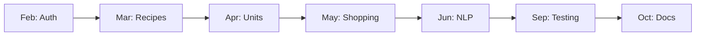

# Timeline

> Tags: `timeline` `planning`

---

## Overview

```
Feb ──── Mar ──── Apr ──── May ──── Jun ──── Sep ──── Oct
 │        │        │        │        │        │        │
Setup   CRUD    Units    Shopping   NLP    Testing   Docs
& Auth  & UI    & DB     List      & Docs  & Menu    Final
```

---

## Monthly Breakdown

| Month | Focus | Key Deliverables |
|-------|-------|------------------|
| [February](February.md) | Foundation | Auth, repo, system design |
| [March](March.md) | Core Features | Recipe CRUD, UI components |
| [April](April.md) | Data Layer | Unit conversion, structured storage |
| [May](May.md) | Smart Features | Shopping list generator |
| [June](June.md) | AI & Docs | NLP implementation, thesis chapters |
| [September](September.md) | Polish | Menu planner, user testing |
| [October](October.md) | Finalize | Complete documentation |

---

## Progress Tracker

```
February   [░░░░░░░░░░] 0%
March      [░░░░░░░░░░] 0%
April      [░░░░░░░░░░] 0%
May        [░░░░░░░░░░] 0%
June       [░░░░░░░░░░] 0%
September  [░░░░░░░░░░] 0%
October    [░░░░░░░░░░] 0%
```

---

## Critical Path



---

## Milestones

| Date | Milestone |
|------|-----------|
| End of Feb | User can register & login |
| End of Mar | User can post recipes with images |
| End of Apr | Ingredients stored in structured format |
| End of May | Shopping list works with multiple recipes |
| End of Jun | NLP parses Hungarian ingredients |
| End of Sep | User testing completed (SUS score) |
| End of Oct | Thesis submitted |

---

## Related

- [February](February.md)
- [March](March.md)
- [April](April.md)
- [May](May.md)
- [June](June.md)
- [September](September.md)
- [October](October.md)
- [Index](00%20-%20Index.md)
