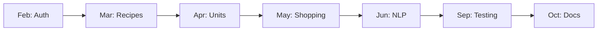

# Timeline

#timeline #planning

---

## Overview

```
Feb ──── Mar ──── Apr ──── May ──── Jun ──── Sep ──── Oct
 │        │        │        │        │        │        │
Setup   CRUD    Units    Shopping   NLP    Testing   Docs
& Auth  & UI    & DB     List      & Docs  & Menu    Final
```

---

## Monthly Breakdown

| Month | Focus | Key Deliverables |
|-------|-------|------------------|
| [[February]] | Foundation | Auth, repo, system design |
| [[March]] | Core Features | Recipe CRUD, UI components |
| [[April]] | Data Layer | Unit conversion, structured storage |
| [[May]] | Smart Features | Shopping list generator |
| [[June]] | AI & Docs | NLP implementation, thesis chapters |
| [[September]] | Polish | Menu planner, user testing |
| [[October]] | Finalize | Complete documentation |

---

## Progress Tracker

```
February   [░░░░░░░░░░] 0%
March      [░░░░░░░░░░] 0%
April      [░░░░░░░░░░] 0%
May        [░░░░░░░░░░] 0%
June       [░░░░░░░░░░] 0%
September  [░░░░░░░░░░] 0%
October    [░░░░░░░░░░] 0%
```

---

## Critical Path



---

## Milestones

| Date | Milestone |
|------|-----------|
| End of Feb | User can register & login |
| End of Mar | User can post recipes with images |
| End of Apr | Ingredients stored in structured format |
| End of May | Shopping list works with multiple recipes |
| End of Jun | NLP parses Hungarian ingredients |
| End of Sep | User testing completed (SUS score) |
| End of Oct | Thesis submitted |

---

## Related

- [[February]]
- [[March]]
- [[April]]
- [[May]]
- [[June]]
- [[September]]
- [[October]]
- [[00 - Index]]
